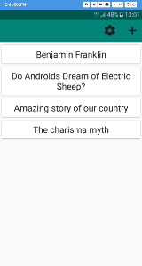
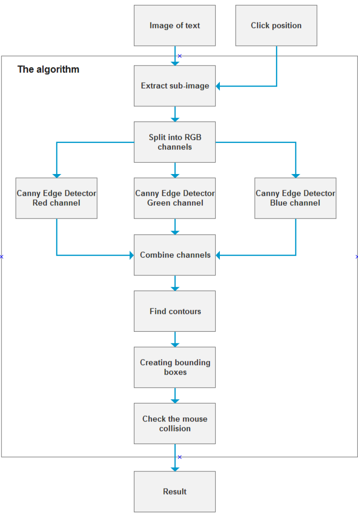
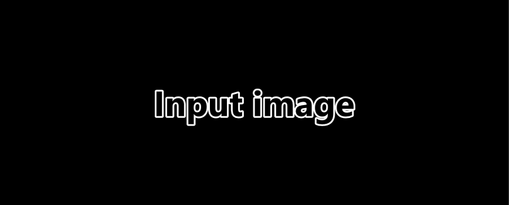
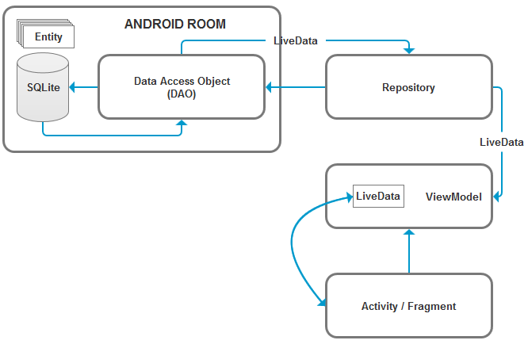

# Note
The published code does not include translation and is published for the purpose of the code overview only.

# TextEye
The goal of this project is to create an Android application that is capable of automatically creating English-Polish flashcards from text recognised in images.

# Table of contents
1. [Demo](#demo)
2. [Features](#features)
3. [Image processing](#img_proc)
4. [Android Architecture Components - MVVM](#arch_comp)

# Demo 

  

# Features 
 - Recognises text in images.
 - Zoom-in zoom-out image.
 - Flashcard swiping mechanism.
 - Automatic translation.

# Image processing 
The application d
For this application the following algorithm is proposed:

### Extract sub-image
Extracting sub-image will allow to speed up the algorithm and perform an image processing faster. The extraction will be done with a static configuration adjusted during development phrase.
### Split into RGB channels
Canny Edge detection algorithm works best when is performed separately for colour channels. This step prepares inputs for Canny Edge algorithm.
### Canny Edge detection
Canny Edge detection is an algorithm that produces structural information for a given image. It calculates intensity gradients and applies thresholds. This step also requires that would differ depending on the lighting in the image. For the simplicity of this algorithm, these parameters will be set statically. The parameters will be found during implementation phrase. They will be adjusted to high contrast images taken with a flashlight, where the text is black and the image is white. The Canny Edge detection algorithm will produce a grayscale image.
### Combine channels
This step will combine previously separated channels into a single grayscale image.
### Find Contours
A contour is a curve that joins continuous points with the same color or intensity This step is performed to locate letters in a picture.
### Create bounding boxes
The purpose of this step is to separate words in a picture. The letters positions found in a previous step can now be surrounded with boxes. By analysis of distances between boxes, letters can be grouped into words. The value of the distance parameter will be defined during the implementation phase. This step will produce boxes positions and sizes for words in a text.
### Check the mouse collision
This step checks if the user clicked any box found in the previous step.
### Result
Result can be an image or a null. If the user missed and did not click any box, the algorithm will return null indicating that it was a miss click. If the user clicks any box, the algorithm will return an image which will contain only the word that the user clicked.

  

# Android Architecture Components - MVVM 
The application is built with the use of [Android Architecture Components.](https://developer.android.com/topic/libraries/architecture "Android Architecture Components"). These components include LiveData, ViewModels and Android Room. The repository class was added for the purpose of the scalability of the application. The architecture of the application can be presented by the following diagram:

  

